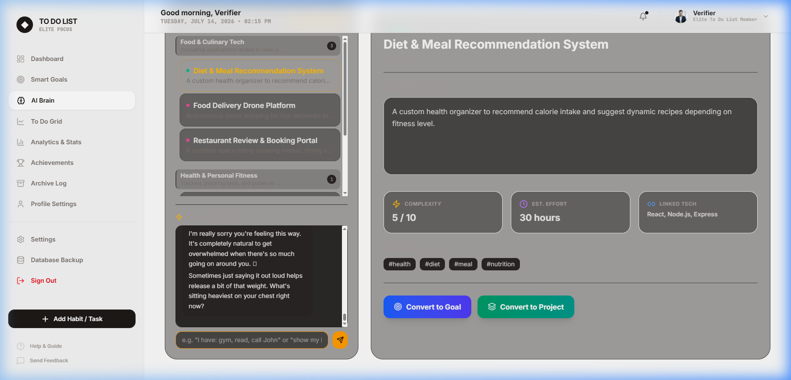
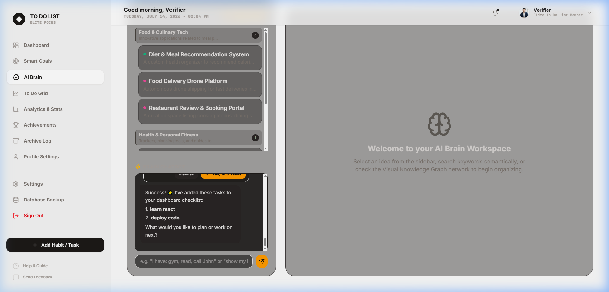
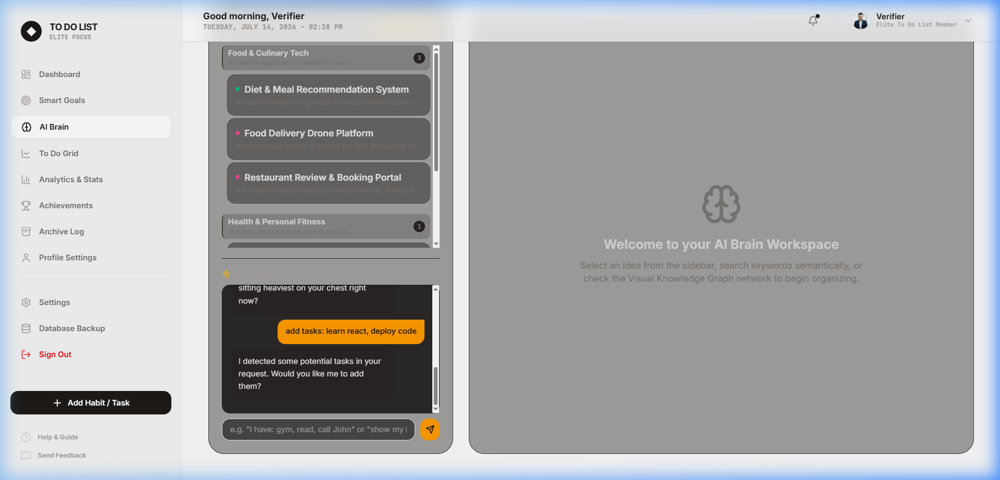

# 🧠 AI Productivity OS — Smart Todo, Goals & Brain Workspace

> A production-ready **AI Productivity Operating System** built with React 19, TypeScript, TailwindCSS v4, and Google Gemini AI. Manage habits, tasks, long-term goals, and ideas in one beautifully integrated workspace.

[](https://github.com/Ali-Khamis45/to-do-list-app-)
[](https://www.typescriptlang.org/)
[](https://react.dev/)
[](https://tailwindcss.com/)
[](https://ai.google.dev/)
[](LICENSE)

---

## ✨ Features at a Glance

| Module | Description |
|--------|-------------|
| 📋 **Todo Manager** | Daily tasks with priority, repeat schedules, notes, and category tracking |
| 📅 **Monthly Habit Grid** | Visual calendar grid with completion/missed/half-done states |
| 🎯 **Smart Goal Planner** | Long-term goals with daily targets, forecasting, and AI coaching |
| 🧠 **AI Brain Workspace** | Idea capture, semantic search, knowledge graph, AI chat, and project generation |
| 📊 **Analytics & Stats** | Habit streaks, focus heatmaps, completion rates |
| 🏆 **Achievements** | Milestone trophy vault unlocked automatically |
| 🔐 **Authentication** | Secure local auth with bcrypt password hashing and session management |
| 🎨 **Theme Engine** | Light, Dark, and Stone themes with live switching |

---

## 🚀 Getting Started

### Prerequisites

- **Node.js** v20.19.0 or v22+ ([nodejs.org](https://nodejs.org/))
- **npm** v10+

### Installation

```bash
# Clone the repository
git clone https://github.com/Ali-Khamis45/to-do-list-app-.git
cd to-do-list-app-

# Install dependencies
npm install

# (Optional) Configure Gemini AI for enhanced AI features
cp .env.example .env
# Edit .env and add your VITE_GEMINI_API_KEY
```

### Running Locally

```bash
npm run dev
# App available at http://localhost:3000
```

### Production Build

```bash
npm run build
# Output in /dist
```

### Type Check

```bash
npm run lint
# Runs tsc --noEmit for zero-error verification
```

---

## 🗂️ Project Structure

```
src/
├── App.tsx                     # Root component, state management, tab routing
├── types.ts                    # Shared TypeScript interfaces (Task, Habit, etc.)
├── index.css                   # TailwindCSS v4 design system & custom utilities
│
├── auth/                       # Authentication & data persistence layer
│   ├── AuthenticationService.ts   # Login, register, logout orchestration
│   ├── PasswordHasher.ts          # bcryptjs password hashing
│   ├── SessionManager.ts          # localStorage session token management
│   ├── UserModel.ts               # Relational schema interfaces
│   └── UserRepository.ts          # localStorage CRUD + seed data
│
├── goals/                      # Smart Goal Planner domain
│   ├── types.ts                   # Goal, Milestone, ProgressLog, GoalMetrics
│   ├── calculations.ts            # Pure math: paces, streaks, health scores
│   ├── forecast.ts                # Exponential decay rolling pace forecasting
│   ├── aiCoach.ts                 # Gemini + local fallback coaching engine
│   └── templates.ts               # 7 pre-built goal templates
│
├── brain/                      # AI Brain Workspace domain
│   ├── types.ts                   # Idea, IdeaLink, IdeaCluster, IdeaExpansion
│   ├── searchEngine.ts            # Semantic search + auto-clustering
│   └── aiService.ts               # AI organize, expand, task generation
│
├── theme/                      # Theme engine
│   ├── ThemeService.ts            # Theme persistence and application
│   └── useTheme.ts                # React hook for theme access
│
└── components/                 # React UI components
    ├── AIBrain.tsx                # AI Brain dashboard workspace
    ├── SmartGoalPlanner.tsx       # Smart Goals dashboard
    ├── HabitGrid.tsx              # Monthly habit tracking grid
    ├── TaskList.tsx               # Daily task checklist panel
    ├── StatsView.tsx              # Focus heatmap and stats sidebar
    ├── MilestonesView.tsx         # Habit milestone cards
    ├── NewTaskModal.tsx           # Task creation form modal
    ├── NewGoalModal.tsx           # Goal creation form with templates
    ├── NewIdeaModal.tsx           # Quick idea capture modal
    ├── LoginView.tsx              # Login form
    ├── RegisterView.tsx           # Registration form
    ├── ProfileView.tsx            # User profile settings
    ├── SettingsView.tsx           # App preferences
    └── BackupView.tsx             # Data export/import
```

---

## 🧠 Autonomous Reasoning AI Operating System (AI OS)

The application features a production-grade, reasoning-first AI Operating System built as a multi-step cognitive pipeline. Rather than a stateless chat interface, it manages dialogue state, plans responses, retrieves relevant semantic context, reasons via collaborative agents, and self-corrects based on user cognitive states.

### 🎥 Screenshots in Action

| Emotional Support & Dialogue Planning | Task Suggestion Confirmation | Dashboard Task Synchronization |
|:---:|:---:|:---:|
|  |  |  |

---

### ⚙️ Cognitive Message Pipeline

Every message is processed through a deterministic 10-step pipeline:

```
User Message
    │
    ▼
1. History Retrieval (ConversationManager loads last 12 turns, Summarizer compresses old history)
    │
    ▼
2. NLP Extraction (IntentClassifier routes core topic; EntityExtractor parses categories/tech tags)
    │
    ▼
3. Dialogue State (DialogueStateManager updates turn counts, active dialogue goal, and sentiment)
    │
    ▼
4. Response Planning (ResponsePlanner builds step-by-step strategy for the active dialogue goal)
    │
    ▼
5. Memory Retrieval (MemoryRetrievalRanker scores & ranks ideas/goals by tag/keyword relevance)
    │
    ▼
6. Prompt Compilation (PromptBuilder compiles state, plan, memory, and workspace context)
    │
    ▼
7. Collaboration (AgentSupervisor orchestrates specialized agents returning typed outputs)
    │
    ▼
8. Tool Decisions (ToolRouter intercepts write calls, ConfirmationEngine suspends for user approval)
    │
    ▼
9. Self-Correction (ReflectionEngine reviews draft, adjusts empathy level, and checks constraints)
    │
    ▼
10. Final Validation (ResponseValidator checks formatting, removes duplicates, renders final response)
```

---

### 🧩 Core Reasoning Layers

The implementation is structured inside `src/brain/core/` and `src/brain/memory/`:

*   **Dialogue State Manager (`DialogueStateManager`):** Maintains the running state of the session, tracking the current user sentiment (e.g., `calm`, `stressed`), session active goal (e.g., `grounding_user`, `brainstorming_mvp`, `clarifying_roadmap`), and message count.
*   **Response Planner (`ResponsePlanner`):** Formulates step-by-step plans for responses. If the user is overwhelmed, the planner enforces an empathetic response path (`validate_empathy → ask_clarification`); if planning a project, it maps progress paths (`suggest_actionable_milestones → request_tech_choices`).
*   **Prompt Builder (`PromptBuilder`):** Merges systemic constraints, user preferences, active planning steps, and ranked context into a single prompt versioned to optimize model token limits.
*   **Memory Retrieval Ranker (`MemoryRetrievalRanker`):** Implements semantic relevance scoring. Instead of supplying all notes, it scores and retrieves only the most relevant ideas and goals matching the parsed user keywords.
*   **Reflection Engine (`ReflectionEngine`):** Acts as a cognitive review gate. It reviews generated text to enforce contractions (making the voice warm and conversational), strips out sterile productivity buzzwords (such as "productivity partner", "optimizing output") during user stress episodes, and keeps the text strictly human-like.
*   **Response Validator (`ResponseValidator`):** Sanitizes and checks formatting, stripping repeated sentences or loops introduced by fallback providers.
*   **Conversation Summarizer (`ConversationSummarizer`):** Merges and condenses historical dialogue turns beyond the 12-turn local window to prevent context overflow.

---

### 👥 Collaborative Multi-Agent System

Specialized agents in `src/brain/agents/` collaborate to solve complex user prompts. Instead of returning raw strings, all agents communicate using a strongly typed **`AgentOutput`** schema:

*   **Coach Agent:** Analyzes pacing, consistency, and progress logs to deliver target conversions and positive feedback.
*   **Planner Agent:** Breaks high-level ideas down into actionable phases, epics, and features.
*   **Idea Agent:** Brainstorms alternative concepts, business monetization plans, and feature requests.
*   **Coding Agent:** Mentors on technology choices, architectures, and design patterns.
*   **Project Agent:** Handles progress tracking, estimation, and target date scheduling.
*   **Research Agent:** Conducts synthetic searching, analyzes competition, and identifies user pain points.
*   **Supervisor (`AgentSupervisor`):** Evaluates intents, assigns primary/secondary agent sub-tasks, merges tool calls, and aggregates agent analyses into a cohesive output.

---

### 🔒 Permission-Based Tool Execution

To ensure absolute safety, the system implements a strict read-write permission boundary:
*   **Read-Only Tools:** (e.g. `ListTasksTool`, `ListGoalsTool`, `SearchTool`) execute automatically to build context.
*   **Write-Mutation Tools:** (e.g. `CreateTaskTool`, `CreateGoalTool`) are intercepted by the **`ConfirmationEngine`**. Instead of mutating the database, the engine suspends the execution, generates a unique Transaction ID, and returns a suggested task payload to the UI.
*   **UI Approval:** The user is shown interactive confirmation cards in the chat view. Upon approval, the pending transaction executes.

---

### 🧠 Semantic Search Dictionary

The local search engine expands queries without requiring external APIs:

| Query | Also Matches |
|-------|-------------|
| `food` | restaurant, cooking, recipes, meal planner, nutrition, food delivery |
| `health` | gym, fitness, diet, exercise, workout, running |
| `coding` | programming, react, typescript, software, saas, backend |
| `startup` | business, mvp, pitch, launch, monetize, founders |
| `money` | finance, savings, invest, stripe, revenue |
| `learning` | education, study, books, skills, course, practice |

---

## 🎯 Smart Goal Planner

Goals are more than just targets — the planner **calculates exactly what you must do today**.

### Supported Goal Types

| Type | Example | Tracking |
|------|---------|---------|
| **Numeric** | Read 50 books | Daily/weekly targets auto-calculated |
| **Milestone** | Launch a SaaS | Prerequisite-linked milestone checklist |
| **Habit** | Code every day | Streak tracking with consistency scores |

### Intelligent Calculations

- **Daily/Weekly/Monthly Targets** — Auto-redistributes missed work
- **Forecasting Engine** — Exponential decay rolling average (14-day window)
- **Completion Probability** — Projects finish date based on actual pace
- **Streak Counting** — Consecutive active logging days
- **Health Score** — Composite metric: pace, consistency, recency

### AI Coach integration

When `VITE_GEMINI_API_KEY` is configured, the AI Coach generates:
- Personalized briefings (morning summary)
- Smart recovery plans
- Daily target conversions (e.g. "0.14 books = 34 minutes reading")
- Encouragement messages based on current pace

Falls back to a comprehensive local rule-based engine offline.

---

## 📋 Todo System

### Task Properties

```typescript
{
  title: string          // Task description
  time: string           // HH:MM scheduled time
  subtext: string        // Additional context
  date: string           // YYYY-MM-DD
  category?: string      // e.g. "Work", "Health"
  priority?: 'low' | 'medium' | 'high'
  reminderDate?: string  // Future reminder date
  repeatType?: string    // 'daily' | 'weekly' | 'monthly'
  notes?: string         // Extended notes
  projectId?: string     // Links to AI Brain project
  ideaId?: string        // Links to source idea
}
```

### Virtual Goal Tasks

Active goals automatically inject **virtual tasks** into the daily checklist:
- `"Spend 34 mins on: Read 50 Books this Year"` — from numeric goals
- `"Milestone: Launch beta testing (Build SaaS MVP)"` — from milestone goals

Ticking a virtual task **logs progress to the goal** automatically. Unticking reverses it.

---

## 🔐 Authentication

All user data is **completely isolated** by `userId`. No data leaks between accounts.

```
Registration → Password hashed with bcryptjs (10 rounds) → stored in localStorage
Login → Hash comparison → Session token stored → User data loaded in isolation
Logout → Session cleared → All state reset
```

---

## 🎨 Theme System

Three built-in themes with instant live switching:

| Theme | Background | Accent |
|-------|-----------|--------|
| `light` | White/Stone-50 | Stone-900 |
| `dark` | Stone-950/Stone-900 | Amber-400 |
| `stone` | Stone-800/Stone-700 | Stone-100 |

---

## ⚙️ Environment Variables

Create a `.env` file at the project root:

```env
# Optional: Enable Gemini AI features (AI Coach, Brain expansion, task generation)
VITE_GEMINI_API_KEY=your_gemini_api_key_here
```

Get your free API key at [aistudio.google.com](https://aistudio.google.com/).

Without a key, all AI features fall back to rich local rule-based engines.

---

## 🏗️ Architecture Principles

- **Clean Architecture**: UI → Services → Domain Models — no circular dependencies
- **SOLID Principles**: Single responsibility per module, open for extension
- **Repository Pattern**: `UserRepository` abstracts all localStorage I/O
- **Dependency Injection**: Services composed at the root `App.tsx` level
- **Pure Functions**: All calculations (`calculations.ts`, `forecast.ts`) are side-effect-free
- **Separation of Concerns**: AI logic, math, storage, and UI never mix

---

## 📦 Tech Stack

| Technology | Version | Role |
|-----------|---------|------|
| React | 19.0.1 | UI framework |
| TypeScript | 5.8 | Type safety |
| TailwindCSS | v4.1.14 | Styling |
| Vite | 6.4.3 | Build tool & dev server |
| @google/genai | 2.4.0 | Gemini AI SDK |
| lucide-react | 0.546.0 | Icon library |
| bcryptjs | 3.0.3 | Password hashing |
| motion | 12.23.24 | Animations |

---

## 📄 License

MIT © [Ali Khamis](https://github.com/Ali-Khamis45)
